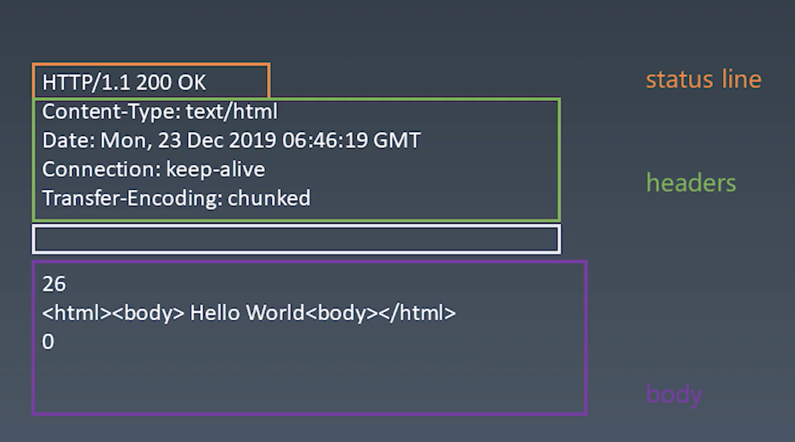

# 学习笔记

## References:
- `p732 - p736`, 带输出的有限状态机, Discrete Mathmatics and Its Applications, Seventh Edition, Chinese Version
- `p64 - p70`, HTTP概况, Computer Networking -- A Top-Down Approach, Seventh Edition, Chinese Version

## Browser Principles in General

 - URL -> bitmap
 - URL(HTTP) -> HTML(Parse) -> DOM(css computing) -> DOM with css(layout) -> DOM with position(render) -> Bitmap

> Explaination
- url通过http请求,从服务器获取资源
- html文件通过浏览器引擎的语法解析生产Dom树
- Dom树与css样式结合
- 生产CSS盒模型和布局
- Dom元素渲染
- 页面转换成bitmap
## Finite-State Machine
- 每一个状态都是一个机器
  - 在每一个机器中，可以做计算、存储、输出
  - 每一个机器接受的输入是一致的
  - 每一个机器本身没有状态，如果用函数表示的话，应该是纯函数（无副作用：不受外部的输入控制）
- 每一个机器都知道下一个状态
  - 有确定的下一个状态（Moore）
  - 根据输入决定下一个状态（Mealy）
## State Machine: Processing String without State Machine
- [code](findABCDEF.js)

## State Machine: Porcessing String with State Machine
- [code](stateMachine.js)
- [exercise 1: process 'abcabx'](match2.js)
- [exercise 2: process 'abababx'](match3.js)
<!-- > [ex3-unknown-pattern](match4-kmp.js) -->
## 网络知识
### ISO-OSI 七层模型
* 应用层
* 表示层
* 会话层
  * 上三层属于Http协议相关的内容，对应require("http")
* 传输层
  * 属于TCP UDP协议的内容，对应require("net")
* 网络层
  * 属于Internet协议内容
* 数据链路
* 物理层
  * 下二层属于4G/5G/wifi内容

### TCP
TCP和UDP协议中数据以流的形式。**端口**是TCP中的重要内容，网卡通过端口将数据分发到各个应用

### IP
ip协议中数据以包的形式，通过IP地址分发内容。在node中没有直接对应的模块，需要使用C++的底层实现libnet/libcap

### HTTP
  - 超文本传输​​协议（HTTP）是一个用于传输超媒体文档（例如 HTML）的`应用层`协议。它是为 Web 浏览器与 Web 服务器之间的通信而设计的，但也可以用于其他目的。HTTP 遵循经典的`客户端-服务端`模型，客户端打开一个连接以发出请求，然后等待直到收到服务器端响应。HTTP 是`无状态协议`，这意味着服务器不会在两个请求之间保留任何数据（状态）。尽管通常基于 TCP/IP 层，但它可以在任何可靠的传输层上使用，也就是说，该协议不会像 UDP 那样静默的丢失消息。RUDP——作为 UDP 的可靠化升级版本——是一种合适的替代选择。

  - http协议是文本型的协议，数据是以字符串的形式存在
## HTTP Request: Parsing Http Protocols
- Request Line
  - [Method](https://developer.mozilla.org/zh-CN/docs/Web/HTTP/Methods)
    - GET
    - POST
    - DELETE
    - PUT
    - HEAD
    - CONNECT
    - OPTIONS
    - TRACE
    - PATCH
  - Url
  - Version: `HTTP/1.1`
- Header
- Body

## HTTP Request: Prepare Server Environment
- [code](server.js)
- use node library `http`

## HTTP Request: Implement A Http Request
  - use node library `net` to implement
  - HTTP 请求
    1. 设计一个 HTTP 请求的类 `Request`
    2. content-type 是一个必要的字段
    3. body 是 KV 格式
    4. 不同的 content-type 会影响 body 格式
  - send 函数
    1. 将真实数据发送到服务器
    2. 异步，返回一个 promise
  - 发送请求
    1. 支持已有的 connection 或者新建自己的 connection
    2. 收到的数据传给 parser
    3. 根据 parser 的状态 reslove promise
  - ResponseParser
    1. response 需要分段构造，所以用 responseParser 来装配
    2. responseParser 分段处理 responseText，所以可以用状态机来解析。
  - BodyParser
    1. Response 的 body 根据 Content-Type 有不同的结果，所以采用子 parser 来处理
    2. 以 TrunkedBodyParser 为例，用状态机来处理 body 的格式

## HTTP Response: Learn Response Format and Write `send` Funtion

- Status Line
  - Version
  - StatusCode
  - Message
- Whitespace Line
- Header
- Body

## HTTP Response: Send Response

> complete the send function
## HTTP Response: Parsing Responses

> complete the response parser
## HTTP Response: Parsing Response Body

> futher implementation of response parser
### 其他
- 四种常见的 **POST** 提交数据方式
  1. application/x-www-form-urlencoded
  2. application/json
  3. application/form-data
  4. text/xml
- 状态机的劣势

在使用状态机之前必须得提前知道所有的状态，如果有新的状态加进来，之前的代码必须得重新审计以免状态切换错误

- 状态机优势

代码逻辑清晰，避免用一个变量来判断不同状态，这样可能导致多个地方更改这个变量引发状态错误。