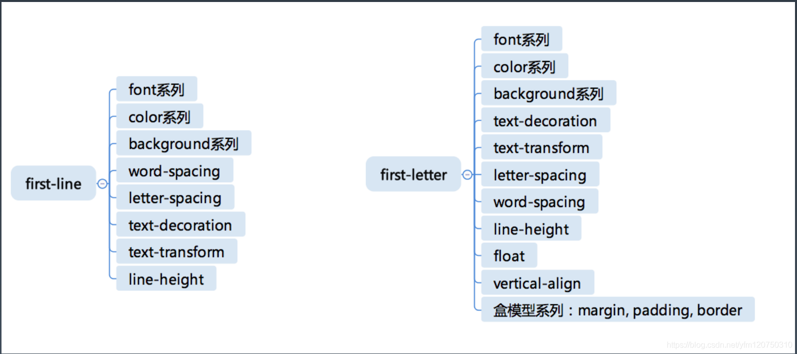

学习笔记

### A Brief Introduction to CSS

#### CSS2.1 Syntax
- https://www.w3.org/TR/CSS21/grammar.html#q25.0
- https://www.w3.org/TR/css-syntax-3/

#### CSS Structure
- @charset
- @import
- rules
  - @media
  - @page
  - rule

#### At-rules
- @charset ： [https://www.w3.org/TR/css-syntax-3/](https://www.w3.org/TR/css-syntax-3/)
- @import ：[https://www.w3.org/TR/css-cascade-4/](https://www.w3.org/TR/css-cascade-4/)
- `@media` ：[https://www.w3.org/TR/css3-conditional/](https://www.w3.org/TR/css3-conditional/)
- @page ： [https://www.w3.org/TR/css-page-3/](https://www.w3.org/TR/css-page-3/)
- @counter-style ：[https://www.w3.org/TR/css-counter-styles-3](https://www.w3.org/TR/css-counter-styles-3)
- `@keyframes` ：[https://www.w3.org/TR/css-animations-1/](https://www.w3.org/TR/css-animations-1/)
- `@fontface` ：[https://www.w3.org/TR/css-fonts-3/](https://www.w3.org/TR/css-fonts-3/)
- @supports ：[https://www.w3.org/TR/css3-conditional/](https://www.w3.org/TR/css3-conditional/)
- @namespace ：[https://www.w3.org/TR/css-namespaces-3/](https://www.w3.org/TR/css-namespaces-3/)

`Important features`：
- @keyframes
- @media
- @fontface

#### CSS Rules
- Selector
  - https://www.w3.org/TR/selectors-3/
  - https://www.w3.org/TR/selectors-4/
- Declaration
  - Key
    - Properties
    - Variables: https://www.w3.org/TR/css-variables/
  - Value
    - https://www.w3.org/TR/css-values-4/
```css
div {
background-color: blue;
}
```

#### Selector Syntax
- Simple Selector
  - *
  - div svg|a
  - .cls
  - #id
  - [attr=value]
  - :hover
  - ::before
- Combined Selector
  - <Simple Selector><Simple Selector><Simple Selector>
  - `*` or `div` must be placed in front
- Complicated Selector
  - `<Combined Selector><sp><Combined Selector>` (ancestor)
  - `<Combined Selector>">"<Combined Selector>` (parent)
  - `<Combined Selector>"~"<Combined Selector>` (adjoint)
  - `<Combined Selector>"+"<Combined Selector>` (union)
  - `<Combined Selector>"||"<Combined Selector>` (table column)

##### A selector's specificity is calculated as follows:

- count the number of ID selectors in the selector (= `a`)
- count the number of class selectors, attributes selectors, and pseudo-classes in the selector (= `b`)
- count the number of type selectors and pseudo-elements in the selector (= `c`)
- ignore the universal selector
- Selectors inside the negation pseudo-class are counted like any other, but the negation itself does not count as a pseudo-class.

> Concatenating the three numbers a-b-c (in a number system with a large base) gives the specificity.

```
Examples:
*               /* a=0 b=0 c=0 -> specificity =   0 */
LI              /* a=0 b=0 c=1 -> specificity =   1 */
UL LI           /* a=0 b=0 c=2 -> specificity =   2 */
UL OL+LI        /* a=0 b=0 c=3 -> specificity =   3 */
H1 + *[REL=up]  /* a=0 b=1 c=1 -> specificity =  11 */
UL OL LI.red    /* a=0 b=1 c=3 -> specificity =  13 */
LI.red.level    /* a=0 b=2 c=1 -> specificity =  21 */
#x34y           /* a=1 b=0 c=0 -> specificity = 100 */
#s12:not(FOO)   /* a=1 b=0 c=1 -> specificity = 101 */
```
#### Pseudo Class
  - link/behaviour
    - :any-link
    - :link :visited
    - :hover
    - :active
    - :focus
    - :target
  - tree
    - :empty
    - :nth-child()
    - :nth-last-child()
    - :first-child :last-child :only-child
  - logic
    - :not
    - :where :has

#### Pseudo Element
- ::before
- ::after
- ::first-line
- ::first-letter

> before和after相当于添加了一个元素，可以设定排列方式伪inline，block，inline-block

*first-line和first-letter的可用属性*



> 思考题： 为什么 first-letter 可以设置 float 之类的，而 first-line 不行呢？ first-letter是在布局完成之后，确定了一段文字中的第一个文字，可以对其操作布局时性能开销小； 而first-line选中的是第一行文字，不同元素的宽度、文档的宽度和文本的字体大小会导致选中的文字内容不一样，要对其重新布局排版消耗性能大,所以first-letter 可以设置 float 之类的，而 first-line 不行。